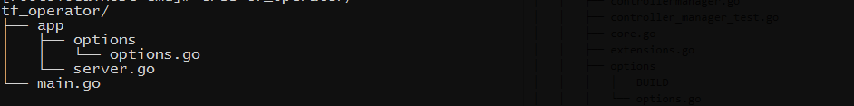
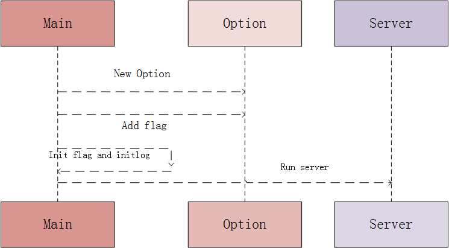

>1、一键完成云端部署，并提供应用全生命周期的管理能力（创建、扩容、监控、健康监测等） 
>2、存储 
>3、集成主流框架 
>(1)分布式的tensorflow要把脚本拷贝到每台分布式集群的机器上，手动配置。调码/调优需要手动Run和Tune; 
>(2)进行建模调优可能出现OOM，可能使用的端口被占用，也可能磁盘故障； 
>基本概念：cluster、job、task。task可以看成是每台机器上的一个进程，多个task组成一个job,job有分为PS和WORKER，PS用于参数服务，WORKER用于计算服务，组成cluster. 
### tensorflow/k8s源码
概念： crd 
<pre><code>
apiVersion: apiextensions.k8s.io/v1beta1
kind: CustomResourceDefinition
metadata:
  # 名称必须符合下面的格式：<plural>.<group>
  name: crontabs.stable.example.com
spec:
  # REST API使用的组名称：/apis/<group>/<version>
  group: stable.example.com
  # REST API使用的版本号：/apis/<group>/<version>
  version: v1
  # Namespaced或Cluster
  scope: Namespaced
  names:
    # URL中使用的复数名称: /apis/<group>/<version>/<plural>
    plural: crontabs
    # CLI中使用的单数名称
    singular: crontab
    # CamelCased格式的单数类型。在清单文件中使用
    kind: CronTab
    # CLI中使用的资源简称
    shortNames:
    - ct
</pre></code>
访问RESTful API端点如http://172.20.0.113:8080将看到如下API端点已创建： 
/apis/stable.example.com/v1/namespaces/*/crontabs/... 
终止器： 
<pre><code>
apiVersion: "stable.example.com/v1"
kind: CronTab
metadata:
  finalizers:
  - finalizer.stable.example.com
</pre></code>
&nbsp;&nbsp;&nbsp;&nbsp;删除自定义对象前，异步执行的钩子。对于具有终止器的一个对象，删除请求仅仅是为metadata.deletionTimestamp字段设置一个值，而不是删除它，这将触发监控该对象的控制器执行他们所能处理的任意终止器。 
概念:  job 
&nbsp;&nbsp;&nbsp;&nbsp;在有些场景下，是想要运行一些容器执行某种特定的任务，任务一旦执行完成，容器也就没有存在的必要了。在这种场景下，创建pod就显得不那么合适。于是就是了Job，Job指的就是那些一次性任务。通过Job运行一个容器，当其任务执行完以后，就自动退出，集群也不再重新将其唤醒. 
yaml配置说明: 
支持两种重启策略： 
OnFailure:在出现故障时其内部重启容器，而不是创建。 
Never:会在出现故障时创建新的，且故障job不会消失。 
#### 细节 
#### job执行完后，不会自动启动一个新的pod，pod也不会被自动删除。 
#### 使用kubectl get pod无法显示执行完的job的pod，需要添加参数—all-show或者-a，kubectl get pods -a。 
 
&nbsp;&nbsp;&nbsp;&nbsp;文件目录的主要代码风格和k8s的 代码分隔一致： 

主要流程: 

&nbsp;&nbsp;&nbsp;&nbsp;tensorflow/k8s 主要的流程依然采用的是和k8s controller-manager一样的逻辑，主要框架是使用informer监听事件，然后在采用leaderelection 包实现高可用，informer的基本框架如下: 

下面提供一个简单的使用代码: 
<pre><code>
package main

import (
	//	"flag"
	"fmt"
	"k8s.io/client-go/kubernetes"
	"k8s.io/client-go/pkg/api"
	"k8s.io/client-go/pkg/api/v1"
	"k8s.io/client-go/pkg/runtime"
	"k8s.io/client-go/pkg/util/wait"
	"k8s.io/client-go/pkg/watch"
	"k8s.io/client-go/tools/cache"
	"k8s.io/client-go/tools/clientcmd"
	"k8s.io/kubernetes/pkg/util/workqueue"
	"time"
)

type TestController struct {
	kubeClient *kubernetes.Clientset
	/*用于建立与apiserver的结构体*/
	podStore cache.StoreToPodLister
	/*存储pod*/
	podController *cache.Controller
	/*监听pod*/
	podsQueue workqueue.RateLimitingInterface
	/*共享队列，用于存储触发事件*/
}

/*client 初始化*/
func getClient(kubeconfig string) *kubernetes.Clientset {
	config, err := clientcmd.BuildConfigFromFlags("", kubeconfig)
	if err != nil {
		panic(err)
	}
	clientset, err := kubernetes.NewForConfig(config)
	if err != nil {
		panic(err)
	}
	return clientset
}

/*TestController 初始化*/
func newTestController(kubeconfig string) *TestController {
	tc := &TestController{
		kubeClient: getClient(kubeconfig),
		podsQueue:  workqueue.NewNamedRateLimitingQueue(workqueue.DefaultControllerRateLimiter(), "pods"),
	}
	tc.podStore.Indexer, tc.podController = cache.NewIndexerInformer(
		&cache.ListWatch{
			ListFunc: func(options api.ListOptions) (runtime.Object, error) {
				return tc.kubeClient.Core().Pods("").List(v1.ListOptions{})
			},
			WatchFunc: func(options api.ListOptions) (watch.Interface, error) {
				return tc.kubeClient.Core().Pods("").Watch(v1.ListOptions{})
			},
		},
		&v1.Pod{},
		0,
		cache.ResourceEventHandlerFuncs{
			AddFunc:    tc.enqueuePod,
			UpdateFunc: tc.updatePod,
			DeleteFunc: tc.enqueuePod,
		},
		cache.Indexers{},
	)
	return tc
}

/*新建pod事件的回调函数*/
func (tc *TestController) enqueuePod(obj interface{}) {
	key, err := cache.DeletionHandlingMetaNamespaceKeyFunc(obj)
	if err != nil {
		fmt.Println("Couldn't get key for object %+v: %v", obj, err)
		return
	}
	tc.podsQueue.Add(key)
}

/*更新pod事件的回调函数*/
func (tc *TestController) updatePod(oldObj, newObj interface{}) {
	oldPod := oldObj.(*v1.Pod)
	newPod := oldObj.(*v1.Pod)

	if newPod.Status.PodIP == oldPod.Status.PodIP {
		return
	}
	tc.enqueuePod(newObj)
}

/*事件处理函数，监听队列，从队列中获取数据*/
func (tc *TestController) podWorker() {
	workFunc := func() bool {
		key, quit := tc.podsQueue.Get()
		if quit {
			return true
		}
		fmt.Println(key)
		obj, exists, err := tc.podStore.Indexer.GetByKey(key.(string))
		if !exists {
			fmt.Printf("Pod has been deleted %v\n", key)
			return false
		}
		if err != nil {
			fmt.Printf("cannot get pod: %v\n", key)
			return false
		}
		pod := obj.(*v1.Pod)

		fmt.Println(pod)
		defer tc.podsQueue.Done(key)
		return false
	}
	for {
		if quit := workFunc(); quit {
			fmt.Println("pod worker shutting down")
			return
		}
	}
}

/*开始运行controller*/
func (tc *TestController) Run(workers int, stopCh <-chan struct{}) {
	//	defer runtime.HandleCrash()

	fmt.Println("Starting Controller Manager...")
	/*开始controller，开始监听pod 事件*/
	go tc.podController.Run(stopCh)

	/*等待初始化数据同步完毕*/
	if !cache.WaitForCacheSync(stopCh, tc.podController.HasSynced) {
		return
	}
	/*开始工作进程，监听共享队列，从队列中获取相关事件并进行处理*/
	for i := 0; i < workers; i++ {
		go wait.Until(tc.podWorker, time.Second, stopCh)
	}
	/*销毁处理*/
	<-stopCh
	fmt.Println("Shutting down Controller Manager")
	tc.podsQueue.ShutDown()
}
func main() {

	//	kubeconfig := flag.String("kubeconfig", "", "Path to a kube config. Only requeiry if out-of-cluster.")
	//	flag.Parse()

	controller := newTestController("/root/.kube/kubeconfig")
	var stopCh <-chan struct{}
	controller.Run(2, stopCh)

	/*	shareInformerFactory := informers.NewSharedInformerFactory(clientset, time.Minute*10)

		topCh := make(chan struct{})

		sharedInformerFactory.Start(stopCh)

		podLister := sharedInformerFactory.Core().V1().Pods().Lister()

		podLister.List(labels.Nothing())
		podLister.Pods("kube-system").Get("kube-dns")
		podLister.Pods("kube-system").List(labels.Nothing())

		fmt.Println("vim-go")*/
}
</pre></code>
tfjob 资源的创建、查找、删除、更新等接口的实现、informer的初始化等，这里都是要自己实现的,主要文件目录如下，。 

### k8s schema设计与使用
### k8s ratelimit 设计与使用
### k8s workerqueue 设计与使用
### k8s clientset 设计与使用

### k8s api 设计与使用
### k8s leaderelection 设计与使用
### k8s client-go rest 设计与使用